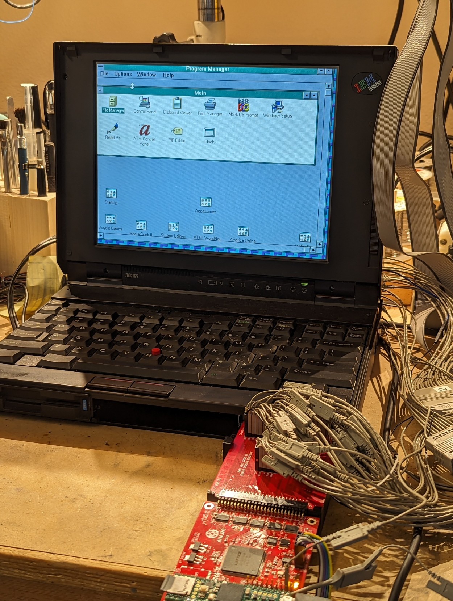
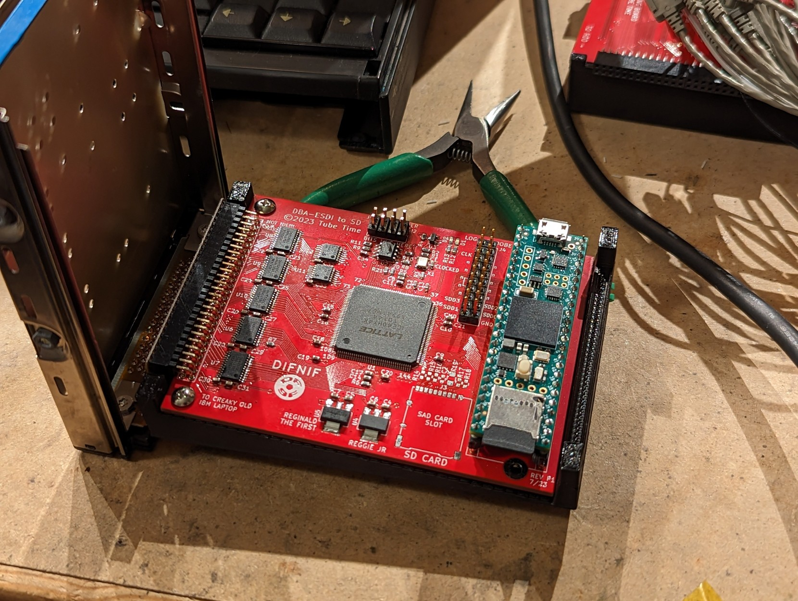
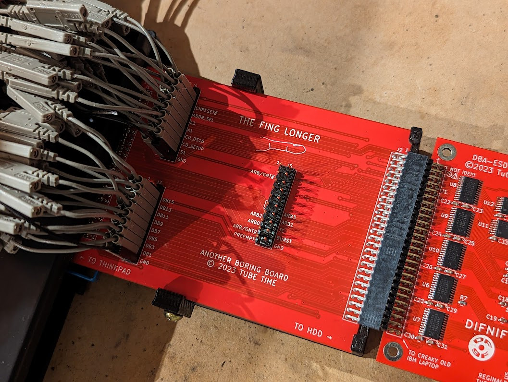

# DifNif DBA-ESDI Solid State Drive Replacement For Thinkpad 700C Computers (For Now)

**ALPHA VERSION**

IBM PS/2 computers from the late 1980s and early 1990s typically used an IBM-proprietary disk interface called DBA-ESDI (Direct Bus Attach - Enhanced Small Device Interface). It is not the same as the industry-standard ESDI drives (which had a separate controller); instead, it is more like an IDE drive, but the register interface is not compatible and it uses the Micro Channel bus instead of the ISA bus.

These special DBA-ESDI drives are getting harder to find and often don't work due to mechanical problems or damage from leaking electrolytic capacitors. DifNif is my solution to this problem. It uses an SD card for storage and modern electronics to implement the DBA-ESDI interface. DifNif is named after the Micro Channel POS ID commonly used by these drives (DF9Fh).

SCSI cards can be found for older PS/2 systems but aren't always compatible with software, particularly old versions of OS/2.

Many PS/2 systems require an IML (initial microcode load) partition located at the end of the disk, and these systems will often only be able to do this with DBA-ESDI drives.

*This project more or less functions but only on the Thinkpad 700C. There's another form factor designed to fit 50Z-style desktop PS/2s, but timing issues seem to prevent it from working properly.*

This is an advanced construction project that you should only attempt if you are comfortable with surface mount soldering. You'll also be flashing two programmable devices, so it helps to have some experience with that. And you'll probably have to do some debugging, so you'll want an oscilloscope and a logic analyzer.

**Data Loss Note**

This is a hobby project. I don't have the resources for an entire QA team, so it is entirely possible to experience data corruption if you use this with your computer. I recommend keeping backup copies of all disk images. This is also an alpha version and I don't have the time to support it, so if you attempt building it, I hope you know what you're doing.

## Overview

There are a number of separate PC boards and 3D printed fixtures associated with them.

First, the [pcb\_thinkpad](pcb\_thinkpad/) directory contains the board files for the main Thinkpad 700C 2.5" form factor drive. There is a 3D-printable sled that the board attaches to, see [mech/df9f\_carrier.stl](mech/df9f\_carrier.STL). The board has a 2mm header that is designed to attach to the flex cable harvested from a stock IBM 2.5" drive for the 700 series Thinkpads. The flex cable has the special connector that plugs into laptop.

To make debugging easier, I built a board called the [Fing Longer](pcb\_finglonger/) (IYKYK) that fits into a [3D-printable sled](mech/finglong.STL) and held in place with two small [clips](mech/2finglong.STL). Typically you will make more than one of these. One acts as an extender card to bring the connector forward and the second one acts as a breakout board so you can connect logic analyzer probes to the MCA bus lines. The DifNif plugs into the end of both Fing Longers.

The second version of the DifNif is a [72-pin card](pcb\_formfactor/) that is designed for machines like the 50Z and others which have a riser card bridging the DBA-ESDI connector to the Micro Channel bus. Debugging this version requires a card that plugs into a spare MCA slot. I use a spare [Snark Barker MCA](https://github.com/schlae/snark-barker-mca) board because it has the proper logic analyzer connectors on it already.

## Software

The [Teensy software](difnift/difnift.ino) is relatively easy to load with the Arduino IDE and the Teensy 4.1 extensions. Nothing unusual there.

The FPGA bitstream is built using the ICE40 yosys/nextpnr toolchain. You can use iceprog and an FTDI adapter just like for the Graphics Gremlin. See [that readme](https://github.com/schlae/graphics-gremlin/) for information about building the project and programming the EEPROM.

There are several source files in the project:

* difnif\_top.v - Top level module that wires up the other modules
* mcabus.v - Micro Channel bus interface that implements the MCA ESDI interface registers, POS registers, and DMA.
* teensy.v - Teensy register interface that allows the Teensy (in another clock domain) to access the ESDI interface mailbox registers and flags

## Drive Images

To assemble a fresh disk image, use dd to generate a blank file. The file must be a multiple of 512 (?) bytes. Put the file on the SD card in the Teensy (for now it must be named "disk0.img"). On the Thinkpad, use the reference disk to create the IML and reference partitions, and then run the DOS installer to partition and format the rest of the disk.

## DIFDIAG

I've written a diagnostic utility for DBA-ESDI drives. It works by accessing the drive hardware directly at a very low level. Don't use it on drives containing data you care about! It can be useful for troubleshooting dead drives, however.

It compiles using the Borland C++ compiler with the Large memory model.

Menus:

* Settings - DMA configuration. Autoconfigure attempts to get the DMA channel assignment with a BIOS call, and if that fails, directly from the extended BIOS data area (EBDA). Or you can manually assign it. You can also set it to PIO mode if you don't want to test DMA.
* Mailbox tests - Not for use on a real drive. If you put the DifNif into a loopback test mode (comment out two lines in loop() in difnift.ino), you can use this to run a few million cycles and ensure that register accesses don't have any timing issues.
* Low level commands - These are the lowest level commands. You have to run them in a specific sequence, following the flowcharts in the [ESDI spec](https://ardent-tool.com/docs/pdf/j_mcspec.pdf).
* Drive information - These send various query commands to the drive to get information about it. Generally safe to run on real drives.
* POST tests - These tests are modeled after the drive tests run by the IBM PS/2 BIOS.
* Run diagnostics - Runs the low-level hardware diag command provided by the DBA-ESDI interface.
* Int13 tests - This destructive test uses BIOS int13 routines to write arbitrary data to the drive, read it back, and compare it to look for mismatches.
* Read sector - This test reads one or more sectors from the drive and dumps them to the screen in hex.

## Bugs

* There seem to be occasional errors when writing sectors. The sector written is shifted by one byte, so it's clearly an off-by-one error somewhere.
* The version for the 50Z has some sort of timing error and register communications don't work correctly.
* And probably more!

## Reference Documents

* [IBM DBA-ESDI reference](https://ardent-tool.com/docs/pdf/j_mcspec.pdf).

## License

This design is secured under the [CERN Open Hardware Licence Version 2 - Strongly Reciprocal](https://ohwr.org/cern_ohl_s_v2.txt).

